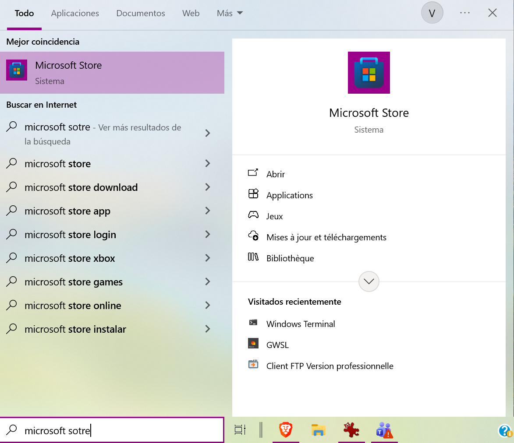
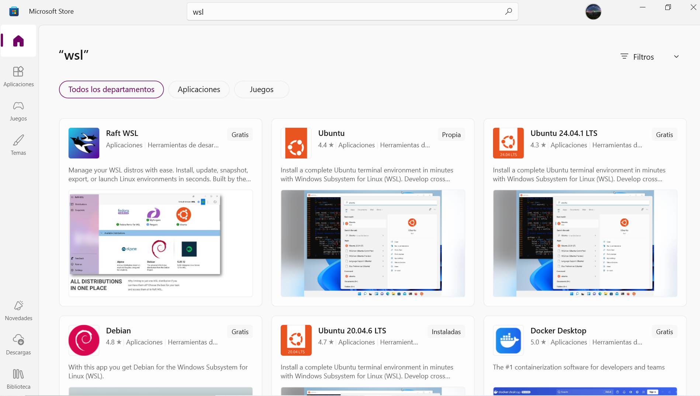
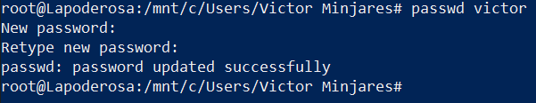

# Usando Windows

## Descargar terminal de GNU/Linux (WSL)

Para poder realizar este tutorial en Windows, primeramente debemos instalar un subsistema Linux en Windows. Este lo podemos encontrar en la *Microsoft store*. Lo podemos encontar en el buscador de nuestro sistema operativo como se ve en la siguiente imagen

{ style="display: block; margin: 0 auto; width: 500px;"}

Una vez abierto *Microsoft store*, en el buscador ingresamos _wsl_ y nos saldran opciones de subsistemas Linux (distribuciones), se puede eligir la que prefiera el usuario

{ style="display: block; margin: 0 auto; width: 500px;"}

Para instalar una distribucion pasamos el raton por encima de la distribucion deseada y en la esquina derecha aparecera un boton para instalarla.  Al terminar la instalacion podemos usar el buscador de Windows para encontrar la distribucion en nuestro sistema

{ style="display: block; margin: 0 auto; width: 500px;"}

En este turorial usaremos la distribucion *Ubuntu 20.04.6 TLS*. Al abrirla, se les abrira una ventaja como la siguiente

{ style="display: block; margin: 0 auto; width: 500px;"}


## Instalacion y configuracion

Con nuestra subsistema Linux instalado, procedemos a la instalacion del cliente de *kubernetes* y su configuracion.

Empezamos clonando el repositorio de *github* y entramos al directorio descargado

```bash
git clone https://github.com/hiramcastillo36/PIG-Resources.git
cd PIG-Resources
```

Ahora instalamos lo necesario corriendo el archivo `wsl-setup.sh`. Con el primer comando lo hacemos ejecutable
```bash
chmod +x wsl-setup.sh
./wsl-setup.sh
```

!!! info "Importante"
    Se neceista tener privilegios de adminstrador para poder correr el archivo `wsl-setup.sh`, si no recuerda cual es tu contrasena de administrador puede ver cómo hacerlo en la [sección de cambio de contrasena de administrador](#reset-pass).

Despues, configuramos *kubernetes* ejecutando el archivo `k8s-setup.sh`.
```bash
./k8s-setup.sh
```

Se nos pedira una llave que nos dara el adminstrador del cluster, como se ve en la siguiente imagen

{ style="display: block; margin: 0 auto; width: 500px;"}

!!! info Importante
    Para obtener la llave, favor de contactar al administrador de sistema de PIG.

Por ultimo, Agregamos la siguiente ruta de la herramienta de linea de comandos para *kubernetes*, llamado *krew*, en el archivo `~/.bashrc` 

```bash
export PATH="${KREW_ROOT:-$HOME/.krew}/bin:$PATH"
```

Al agregar el `PATH` recargamos el archivo

```bash
source ~/.bashrc
```

Para verificar que la instalacion y configuracion fue exitosa. En esta caso, usaremos el siguiente comando

```bash
kubectl get pods
```

Al ejecutar el comando se abrira una pagina nueva en su navegador predeterminado con la siguiente pagina

{ style="display: block; margin: 0 auto; width: 500px;"}

Donde debera entrar las credenciales de su cuenta dentro de PIG que el administrador le dio. Si la conexion fue exitosa, en la terminal obtendra el resultado del comando de *kubernetes*

{ style="display: block; margin: 0 auto; width: 500px;"}

Este comando nos muestra los pods actuales en PIG.

## Cambiar constrasena de administrador (opcional) {: #reset-pass }

Para cambiar la contrasena de su usuario con privilegios de administrador en WSL, podemos hacerlo desde la terminal *Windows PowerShell*, la cual ya esta instalada en *Windows* por predeterminado. En la terminal ejecutamos el comando

```powershell
wsl -d Ubuntu-20.04 --user root
```
En este caso, entramos a la distribucion `Ubunut-20.04` ya que fue la que instalamos, usted pondria la distribucion instalada. Al hacerlo vera que su usuario cambiara a `roor` como en la imagen 
{ style="display: block; margin: 0 auto; width: 500px;"}

Por ultimo, cambiamos la contrasena de nuestro usuario, en mi caso es `victor`, como se ve a continuacion

{ style="display: block; margin: 0 auto; width: 500px;"}

Con esto ya podremos ejecutar los archivos usando esta nueva contrasena.


